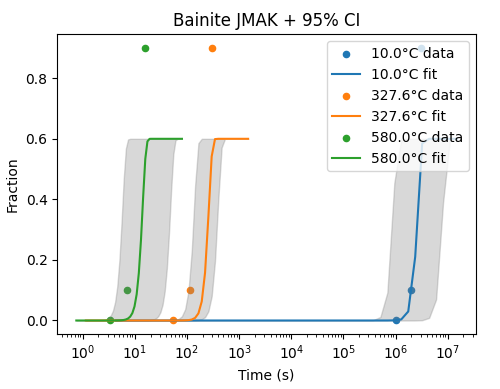
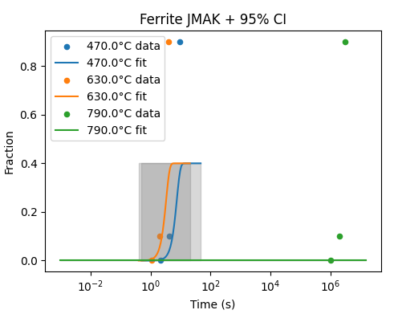
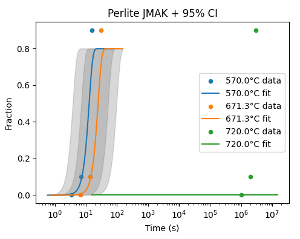

# phase-transformation-jmak
This repository implements isothermal phase-transformation kinetics modeling using the Johnson–Mehl–Avrami–Kolmogorov (JMAK) equation on steel TTT data.
## Contents
- `docs/theory.md`: Two-page theoretical background on the JMAK model and its application to ferrite, pearlite, and bainite transformations
- `docs/code_explanation.md`: Step-by-step explanation of each part of the code
- `src/jmak_model.py`: Main Python script
- `notebooks/analysis.ipynb`: Jupyter notebook combining code, results, and figures
- `data/TTT_data_Steel.csv`: raw input data
- `data/TTT_synthetic.xlsx`: generated synthetic curves & parameters

---

## Key Results & Figures

### JMAK Fit with 95 % Confidence Bands (Bainite)

*Bainite transformation curves at 10 °C, 327.6 °C, and 580 °C. Dots are the 0 %, 10 % and 90 % anchor points, lines are the fitted JMAK models, and gray bands show ±1.96σ uncertainty from the GP on ln k(T).*

### JMAK Fit with 95 % Confidence Bands (Ferrite)

*Ferrite transformation at 470 °C, 630 °C, and 790 °C. Experimental data points (dots), global‐n JMAK fits (lines), and GP‐derived 95 % CI bands (shading).*

### JMAK Fit with 95 % Confidence Bands (Pearlite)

*Pearlite transformation at 570 °C, 671.3 °C, and 720 °C. The JMAK curves (solid) accurately track the 0–10–90 % data (markers), with uncertainty bands from the GP smoothing.*

---

## Usage
1. Clone the repository
2. Install dependencies: `pip install -r requirements.txt`
3. Run `src/jmak_model.py` or open `notebooks/analysis.ipynb`

## License
MIT License
