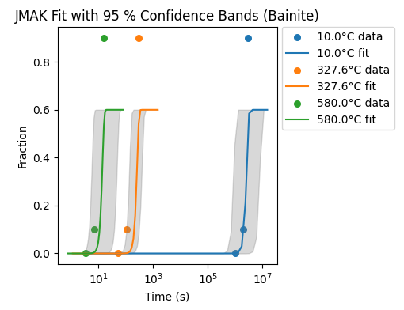
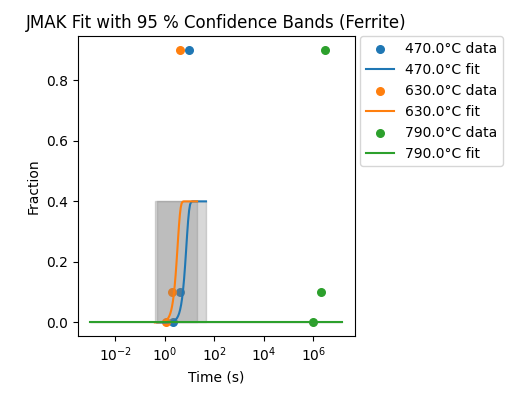
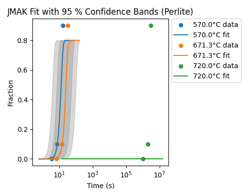

# Phase Transformation Modeling using the Johnson–Mehl–Avrami–Kolmogorov Equation

## Johnson–Mehl–Avrami–Kolmogorov (JMAK) Equation

A classical model for isothermal phase-transformation kinetics in steels. It describes the transformed fraction _f_ as a function of time _t_ using three parameters:

- **y_max**: the maximum fraction transformed at long times  
- **k**: a rate constant that depends on temperature  
- **n**: the Avrami exponent, which captures how nucleation and growth proceed  

> “The JMAK equation predicts that the fraction transformed starts at zero and asymptotically approaches a maximum value _y_max_, following an S-shaped curve whose steepness is governed by _k_ and whose curvature is governed by _n_.”

---

## Contents

- [Theory Background](theory.md) – two-page theoretical write-up  
- [Code Explanation](code_explanation.md) – step-by-step walkthrough

---

## Key Results & Figures

### Bainite

Bainite transformation curves at 10 °C, 327.6 °C, and 580 °C. Dots are the 0 %, 10 % and 90 % anchor points, lines are the fitted JMAK models, and gray bands show ±1.96σ uncertainty from the GP on ln k(T).

### Ferrite

Ferrite transformation at 470 °C, 630 °C, and 790 °C. Experimental data points (dots), global‐n JMAK fits (lines), and GP‐derived 95 % CI bands (shading).

### Pearlite

Pearlite transformation at 570 °C, 671.3 °C, and 720 °C. The JMAK curves (solid) accurately track the 0–10–90 % data (markers), with uncertainty bands from the GP smoothing.

---

## Usage
1. Clone the repository
2. Install dependencies: `pip install -r requirements.txt`
3. Run `src/jmak_model.py` or open `notebooks/analysis.ipynb`

## License
MIT License
